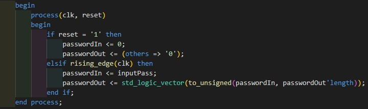
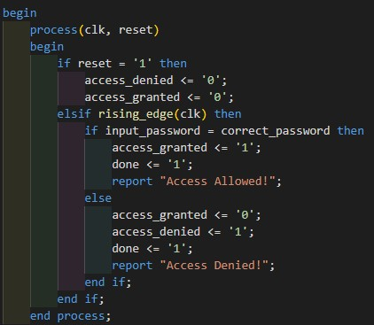
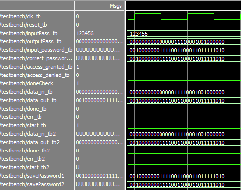
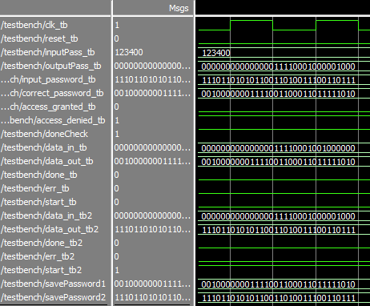

# AP11-Final Project-PSD2023 - Keypad Door Lock System with Anti Tampering

## Background
One increasingly popular security system is the keypad door lock system, utilizing a keypad, which offers a higher level of security compared to conventional lock systems. Equipped with anti-tampering technology to detect and issue warnings against attempts at system sabotage. By combining commonly used keypad technology with the MD5 encryption method, this project aims to provide an optimal level of security, safeguarding sensitive user data, and offering a cutting-edge security solution in this digital era.

## Objectives
1. In fulfillment of the principles within the Digital System Design Practicum.
2. Implementing VHDL Programming.
2. Designing a device for the implementation of a Keypad Door Lock System.
4. Implementing Hashing with the MD-5 Algorithm in the design.

## Implementation
The Keypad Door Lock System with Anti-Tampering is implemented using a 6-bit integer code. Users are prompted to input the code through a keypad, which is then converted into an integer value. Upon each unsuccessful attempt, the system records the number of attempts and takes action if the predefined limit is reached. This anti-tampering detection can trigger additional security measures, such as notifying the owner to take further action. Consequently, the system enhances door security by responding to suspicious activities and effectively addressing unauthorized attempts.

To increase the security level of this system, the code undergoes hashing before verification. The hashing algorithm employed is MD5. However, since the hashing function only accepts binary inputs, the integer-based code input undergoes a conversion process. The following code snippet performs the conversion of the user-input code.

### Password Converter
The ConverterPassword.vhd is like a conductor that transforms a password from a simple number to a more complex code. Imagine it as a translator for passwords. It has four entry points: one for timing (clk or clock signal), one for starting fresh (reset), one for the initial password (inputPass), and one for the translated result (outputPass).

Inside, there are two important parts: passwordIn and passwordOut. When we hit the reset button, these start fresh, like erasing a chalkboard. Then, when the clock ticks (like a heartbeat), the module takes the initial password, updates it, and turns it into a more complex code called std_logic_vector. This new code is then sent out through the outputPass door.

### Hashing (MD5)
The VHDL code defines a module implementing the MD5 hashing algorithm, named MD5. This cryptographic hash function is designed to process input data and produce a 128-bit hash value. The entity includes various ports, such as data_in for input, data_out for the hash result, and signals like done indicating completion.

The code introduces subtypes and constants crucial for MD5 computations. It follows a finite state machine (FSM) approach, with processes managing clock synchronization, data processing, and algorithm stages. The algorithm progresses through loading data, padding, bit rotation, and hash result extraction.

The calc process handles MD5 computations, responding to clock signals and managing the algorithm's internal state. The MD5 algorithm stages are structured and adhere to established sequences. It efficiently transforms input data into a fixed-size hash, signaling completion through the done signal.

### Password Checker
The VHDL code defines a 'Checker' module for password validation. On a rising clock edge, it compares the input and correct passwords. A match sets 'access_granted' to '1,' signaling access allowed. A mismatch sets 'access_denied' to '1,' signaling access denied. The 'done' signal indicates completion.

### Testbench
The VHDL testbench code serves as a simulation environment for evaluating the functionality of three components: ConverterPassword, Checker, and dual instances of the MD5 module. It orchestrates clock signals and reset operations to simulate the flow of these components in a controlled environment.

The ConverterPassword component converts an integer-based password into a 32-bit vector, while the Checker component compares this converted password with a correct one. The testbench also utilizes two instances of the MD5 module to process different inputs and generate hash outputs.

The temporal aspects are managed by a clock process, and the Alur_Program process defines the sequence of actions for the testbench, including initiating hashing processes and verifying results through the Checker component.

## Testing
To facilitate the testing process, a testbench code is used. Signals for system-wide reset and clock are defined, followed by the definition of signals for each component involved in this testing, namely converterPassword, MD5, and checker. After defining these components, the next step is to perform port mapping between the testbench signals and the ports in the components. The following is the code used to organize the flow of the testbench.

1. Performing a reset for all programs.
2. Performing the conversion for the correct password. This conversion is done from decimal to binary.
3. Performing hashing on the converted password.
4. Saving the password to the signal savePassword1.
5. Performing conversion for the password entered by the user.
6. Performing hashing on the converted password.
7. Saving the password to the signal savePassword2.
8. Comparing savePassword1 and savePassword2.

In this testbench code, the correct password given is 123456, and the passwords to be tested are 123456 (to observe the system output when the correct password is entered) and 123400 (to observe the system output when an incorrect password is entered).

## Results

### Waveform
The following is a wave simulation conducted in ModelSim for the correct password, which is 123456.

The following is a waveform simulation conducted in ModelSim with the correct password as input.

The following is a waveform simulation conducted in ModelSim with an incorrect password as input.

We can see the difference in the access_granted and access_denied flag. When the user inputs a correct password, then the program's access_granted flag will be 1 and the access_denied will be 0. And the opposite applies when the user inputs an incorrect password, the access_denied flag will be 1 and the access_granted flag wil be 0.

### Synthesis
By using the sythesis feature provided by Quartus, we are able to get:
